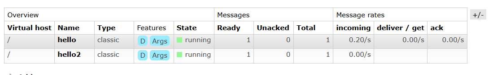
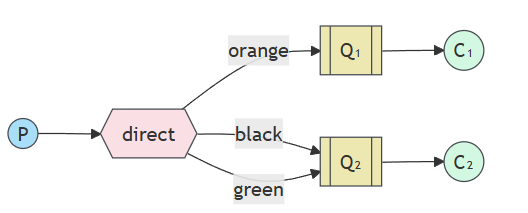

# Proyecto de ejemplo: Envío y recepción de mensajes con RabbitMQ

Este proyecto es una guía básica para entender cómo funcionan las colas (queue), los exchanges y la publicación/recepción de mensajes usando RabbitMQ.

## Instalación de RabbitMQ usando Docker

1. Asegúrate de tener Docker instalado en tu máquina.
2. Ejecuta el siguiente comando para iniciar un contenedor de RabbitMQ con la interfaz de administración habilitada:

   ```bash
   docker run -d --name rabbitmq -p 5672:5672 -p 15672:15672 rabbitmq:4-management
   ```

3. Accede a la interfaz de administración en: [http://localhost:15672](http://localhost:15672)
   - Usuario: `guest`
   - Contraseña: `guest`

## Conceptos básicos

- **Queue (Cola):** Es donde se almacenan los mensajes hasta que son consumidos por un receptor.
- **Exchange:** Recibe los mensajes de los productores y los dirige a una o varias colas según reglas de enrutamiento.
  - **Fanout Exchange:** Un exchange de tipo `fanout` reenvía todos los mensajes que recibe a todas las colas que están enlazadas a él, sin importar el contenido del mensaje o la clave de enrutamiento. Es útil para casos de difusión (broadcast), donde todos los consumidores reciben todos los mensajes.
  - **Direct Exchange:** Un exchange de tipo `direct` envía los mensajes solo a las colas que coincidan exactamente con la clave de enrutamiento (`routing key`) especificada. Es útil cuando quieres que ciertos mensajes lleguen solo a ciertos consumidores.
- **Publicar mensajes:** Es el proceso de enviar mensajes a un exchange.
- **Recibir mensajes:** Es el proceso de consumir mensajes desde una cola.
- **ACK (Acknowledgement):** Es una confirmación que envía el consumidor a RabbitMQ para indicar que el mensaje fue recibido y procesado correctamente. Si no se envía el `ack`, el mensaje puede ser reenviado a otro consumidor.

## Ejecución del proyecto

1. Asegúrate de que RabbitMQ esté corriendo (ver sección de instalación).
2. Ejecuta el emisor (sender) para publicar mensajes.
3. Ejecuta el receptor (receiver) para consumir mensajes de la cola.

## Estructura del proyecto

- `Send`: Proyecto para enviar mensajes.
- `Receive`: Proyecto para recibir mensajes con exchange tipo fanout.
- `Receive2`: Proyecto para recibir mensajes con exchange tipo direct (enrutamiento).

---

## Ejemplo 1: Exchange sin enrutamiento (fanout)



**Fanout** distribuye todos los mensajes a todas las colas conectadas, sin importar el contenido del mensaje.

### Enviar mensajes (Send)

```csharp
// Program.cs del proyecto Send
using RabbitMQ.Client;

string queueName = "hello";
try
{
    Console.WriteLine("Connecting to RabbitMQ...");
    var factory = new ConnectionFactory { HostName = "localhost", Port = 5672, UserName = "guest", Password = "guest" };

    await using var connection = await factory.CreateConnectionAsync();
    await using var channel = await connection.CreateChannelAsync();

    string opcion = Console.ReadLine() ?? "1";
    const string message = "Hello World!";
    var body = System.Text.Encoding.UTF8.GetBytes(message);

    if (opcion == "1")
    {
        Console.WriteLine("Sending message Fanout...");
        await channel.ExchangeDeclareAsync(exchange: "logs", type: ExchangeType.Fanout);
        await channel.BasicPublishAsync(exchange: "logs", routingKey: String.Empty, body: body);
    }
    else
    {
        Console.WriteLine("Sending message Direct...");
        await channel.ExchangeDeclareAsync(exchange: "logs", type: ExchangeType.Direct);
        await channel.BasicPublishAsync(exchange: "logs", routingKey: "info", body: body);
    }
}
catch (Exception ex)
{
    Console.WriteLine($"Error connecting to RabbitMQ: {ex.Message}");
}

Console.WriteLine("sending message to RabbitMQ...");
Console.ReadLine();
```

### Recibir mensajes (Receive)

```csharp
// Program.cs del proyecto Receive (fanout)
using RabbitMQ.Client;
using RabbitMQ.Client.Events;
using System.Text;

var queueName = "hello";
var exchange = "logs";
try
{
    var factory = new ConnectionFactory { HostName = "localhost" };

    await using var connection = await factory.CreateConnectionAsync();
    await using var channel = await connection.CreateChannelAsync();

    await channel.QueueDeclareAsync(queueName, true, false, false, null);
    await channel.QueueBindAsync(queue: queueName, exchange: exchange, routingKey: string.Empty);

    var consumer = new AsyncEventingBasicConsumer(channel);
    consumer.ReceivedAsync += (model, ea) =>
    {
        var body = ea.Body.ToArray();
        var message = Encoding.UTF8.GetString(body);
        Console.WriteLine($" [x] {message}");
        return Task.CompletedTask;
    };

    await channel.BasicConsumeAsync(queueName, autoAck: true, consumer: consumer);
}
catch (Exception e)
{
    Console.WriteLine(e);
    throw;
}

Console.ReadLine();
```

---

## Ejemplo 2: Exchange con enrutamiento (direct)



**Direct** permite enviar mensajes a colas específicas usando una clave de enrutamiento (`routing key`).

### Enviar mensajes (Send con opción 2)

```csharp
// Program.cs del proyecto Send (selecciona opción 2 para direct)
using RabbitMQ.Client;

string queueName = "hello";
try
{
    Console.WriteLine("Connecting to RabbitMQ...");
    var factory = new ConnectionFactory { HostName = "localhost", Port = 5672, UserName = "guest", Password = "guest" };

    await using var connection = await factory.CreateConnectionAsync();
    await using var channel = await connection.CreateChannelAsync();

    string opcion = Console.ReadLine() ?? "1";
    const string message = "Hello World!";
    var body = System.Text.Encoding.UTF8.GetBytes(message);

    if (opcion == "1")
    {
        Console.WriteLine("Sending message Fanout...");
        await channel.ExchangeDeclareAsync(exchange: "logs", type: ExchangeType.Fanout);
        await channel.BasicPublishAsync(exchange: "logs", routingKey: String.Empty, body: body);
    }
    else
    {
        Console.WriteLine("Sending message Direct...");
        await channel.ExchangeDeclareAsync(exchange: "logs", type: ExchangeType.Direct);
        await channel.BasicPublishAsync(exchange: "logs", routingKey: "info", body: body);
    }
}
catch (Exception ex)
{
    Console.WriteLine($"Error connecting to RabbitMQ: {ex.Message}");
}

Console.WriteLine("sending message to RabbitMQ...");
Console.ReadLine();
```

### Recibir mensajes (Receive2)

```csharp
// Program.cs del proyecto Receive2 (direct)
using RabbitMQ.Client;
using RabbitMQ.Client.Events;
using System.Text;

var routingKey = "info";
var exchange = "logs";
var queueName = "hello2";

try
{
    var factory = new ConnectionFactory() { HostName = "localhost" };
    await using var connection = await factory.CreateConnectionAsync();
    await using var channel = await connection.CreateChannelAsync();

    await channel.QueueDeclareAsync(queue: queueName, durable: true, exclusive: false, autoDelete: false,
        arguments: null);
    await channel.QueueBindAsync(queue: queueName, exchange: exchange, routingKey: routingKey);

    var consumer = new AsyncEventingBasicConsumer(channel);
    consumer.ReceivedAsync +=  (model, ea) =>
    {
        var body = ea.Body.ToArray();
        var message = Encoding.UTF8.GetString(body);
        Console.WriteLine($" [x] {message}");
        return Task.CompletedTask;
    };

    await channel.BasicConsumeAsync(queue: queueName, autoAck: true, consumer: consumer);
}
catch (Exception ex)
{
    Console.WriteLine($"An error occurred: {ex.Message}");
}

Console.ReadLine();
```

---

## Recursos útiles

- [Documentación oficial de RabbitMQ](https://www.rabbitmq.com/documentation.html)
- [RabbitMQ Tutorials](https://www.rabbitmq.com/getstarted.html)
